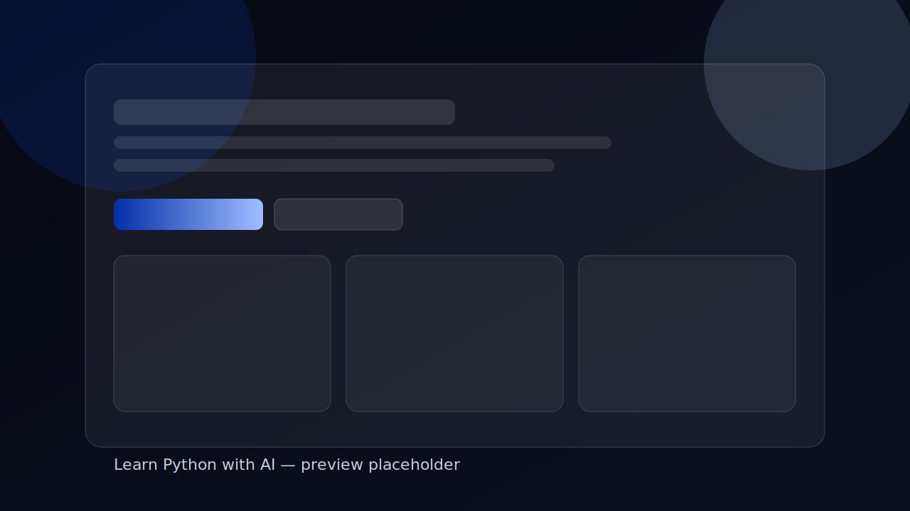

# Learn Python with AI

A friendly single-page site about learning Python with AI, with side quests in coding, vinyl, and cats.

## Live Site

- https://ioanadaria.github.io/Learn-Python-with-AI/

## Screenshot

> Note: This is a styled placeholder preview. Replace it with a real screenshot anytime for a stronger portfolio thumbnail.

## Overview

This project is a lightweight personal learning log built as a static HTML page.

Current focus:
- Python fundamentals
- AI-assisted learning (without over-relying on it)
- Clean structure and accessibility basics

## Tech Stack

- HTML5
- Inline CSS (no external framework)
- No build step

## Project Structure

- `index.html` — main page content and styles
- `spec.md` — implementation notes and step goals

## Run Locally

Because this is a static page, you can open it directly in your browser:

1. Open `index.html`
2. Or use VS Code Live Server if you prefer local hosting

## Roadmap

- [x] Single-page structure and section navigation
- [x] Styled hero, projects, and skills sections
- [x] Contact links (including Instagram)
- [ ] Add simple form with validation
- [ ] Add basic tests/checklist for manual QA
- [x] Publish with GitHub Pages

## Accessibility Notes

- Skip link for keyboard users
- Focus-visible styles for links/buttons
- Reduced motion support (`prefers-reduced-motion`)

## License

Personal learning project.

## Author

- GitHub: https://github.com/ioanadaria
- Instagram: https://instagram.com/ioanadaria
